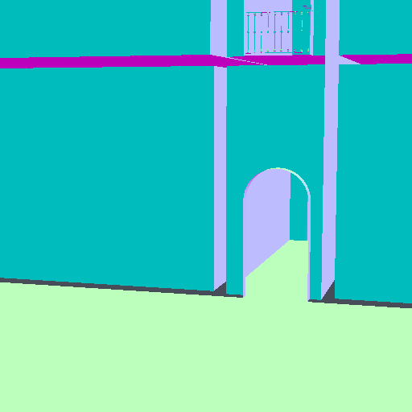
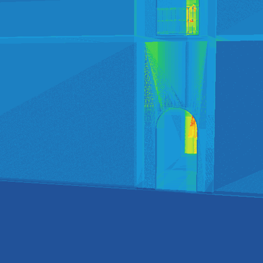
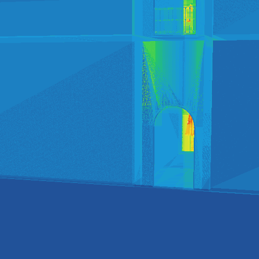

# Geometry-derived Direction D on San Miguel — BVH8 collapse

**Date:** 2026-09-01 · **Run id:** `geo_w8_2026_09_01` · **Scene:** `scenes/san-miguel.obj` (9,971,513 triangles)

> **No rays were used to construct any tree.** All directional construction
> information came from triangle projections accumulated inside each subtree.
> Every tree in this experiment was built and finalised before a single
> evaluation ray existed. The three frozen cameras are evaluation inputs only;
> the CSV records `rays_used_in_construction = 0` on every row.

---

## Plain-language answer

**1. Did triangle-derived Direction D reduce traversal work?**
Barely, and not reliably. At the preregistered `mu = 1.0` it changed node steps
per ray by **−0.22 % (View A)**, **−2.24 % (View B)** and **+0.73 % (View C)**.
Two views improve, one gets worse, and the largest effect is about 2 %. This is
not a meaningful reduction in traversal work.

**2. How much did node steps and box tests change at `mu = 1.0`?**

| view | node steps | box tests |
|---|---|---|
| A | **−0.22 %** | **−0.23 %** |
| B | **−2.24 %** | **−2.35 %** |
| C | **+0.73 %** | **+0.73 %** |

Box tests track node steps almost exactly, which is expected: the collapse
changes which interior nodes exist, and each visit tests that node's children.

**3. Did it outperform the non-directional scalar-density control?**
**Marginally and inconsistently.** At the same `mu = 1.0`, `Lscalar` gives
+2.53 % / +4.63 % / −2.21 % on views A/B/C against `Ldir`'s −0.22 % / −2.24 % /
+0.73 %. So `Ldir` is better on A and B and worse on C. Averaged over the three
views `Ldir` is −0.58 % and `Lscalar` is +1.65 %, so the directional term is the
less harmful of the two — but neither is a win, and a 2 percentage-point edge
built on one scene and three views is not evidence of a directional mechanism.

The two losses do behave differently, so the control is doing its job: at
`mu = 1.0`, `Ldir` drives the tree's summed directional loss from 3.2686 to
2.9375 (−10.1 %) while `Lscalar` drives its own summed loss from 3.6436 to
3.2710 (−10.2 %). Each objective successfully minimises what it was asked to
minimise. Neither translates into traversal savings.

**4. Did primitive work or tree size regress?**
Essentially no change. Primitive steps and triangle tests move by
**−0.00 % / +1.28 % / −0.02 %** on views A/B/C — the leaf term is untouched by
construction, and the measurement confirms it. Wide node count grows by
**+0.12 %** (11,927,443 → 11,928,873), emitted depth is unchanged at **49**, and
`bvh_bytes` grows by the same 0.12 %. Ordinary SAH cost worsens slightly, from
29.6943 to 29.8462 (**+0.51 %**), which is the expected price of optimising a
different objective.

**5. What do the paired heatmaps show?**
Almost nothing changes. Of 262,144 pixels, **94.10 % are byte-identical** between
the two heatmaps; 3.88 % got cooler (fewer traversal steps) and 2.02 % got hotter.
The differences are confined to the archway opening and the balcony railing —
the only regions of this view with real depth complexity. The large flat wall and
floor, which dominate the image, are unchanged because a ray that hits a wall
immediately never reaches the part of the hierarchy the collapse reorganised.

### Verdict

**Geometry-derived Direction D does not help on San Miguel.** It moves traversal
work by under 2.5 % in either direction depending on the camera, it is not
consistently better than the non-directional density control, and it costs a
small amount of ordinary SAH quality and tree size. The collapse decisions do
change — 4.48 % of retained/absorbed decisions at `mu = 1.0` — so the term is
active and doing what it was asked to do; it simply does not select a better
grouping of BVH8 children.

---

## Scene context and paired traversal-step heatmaps

View A, 512×512, identical camera and identical rays for both images.

**Colour render (scene context)**



**Traversal-step heatmaps.** These visualise `trace_stats::total_steps()`
(`node_steps + prim_steps`) per pixel — *not* node steps alone. Both images use
one shared colour scale computed from the two count arrays combined and passed
explicitly to both `image::from_counts` calls.

**Shared colour scale maximum: 56 traversal steps per pixel.**

| ordinary SAH BVH8 | Direction D BVH8, `mu = 1.0` |
|---|---|
|  |  |

---

## Method

**Hypothesis.** Starting from one ordinary binary SAH tree, does adding a
geometry-derived axis-projected emptiness loss to the ordinary SAH collapse cost
select a better set and grouping of BVH8 children?

**Descriptor**, reusing the already-tested code in `bvh/eval/directional_geometry.*`.
Per triangle, with `c = cross(v1 - v0, v2 - v0)`:

```
g.x = 0.5*|c.x|   (YZ)     g.y = 0.5*|c.y|   (XZ)     g.z = 0.5*|c.z|   (XY)
A_triangle = 0.5*|c|
```

accumulated bottom-up over each binary subtree into `G(n)` and `Atri(n)`.

**Losses.** For node extents `(ex, ey, ez)` with `Fx = ey*ez`, `Fy = ex*ez`,
`Fz = ex*ey`, `SA = 2(Fx + Fy + Fz)`:

```
Ex = max(Fx - G.x, 0)   Ey = max(Fy - G.y, 0)   Ez = max(Fz - G.z, 0)
Ldir(n)    = 2 * (Ex + Ey + Ez)                    directional
Lscalar(n) = max(SA(n) - 2*Atri(n), 0)             non-directional control
```

Both are in `[0, SA]` and carry area units. `Ldir` is deliberately one-sided:
projected triangle areas overlap, so an axis whose projected geometry already
exceeds the box face contributes zero loss rather than a negative one.

**Objective.** The loss is added to the internal-node term only:

```
C_internal = c_traversal * (SA(n) + mu * L(n))
C_leaf     = c_intersect * primitive_count(n) * SA(n)      <- unchanged
```

The distribute recurrence is unchanged. `collapse_args::node_internal_area`
feeds only the internal term, so a loss can never silently alter the
primitive-intersection term. `mu = 0` fills that array by calling
`aabb::surface_area()` itself, which is why the identity below is exact.

**Variants.** One shared binary `binned_sah`, 32-bin, `max_leaf_size = 1` tree
for all nine: ordinary SAH; `Lscalar` at `mu = 0.25/0.5/1.0/2.0`; `Ldir` at the
same four. `mu = 1.0` is the preregistered primary comparison — the other values
are sensitivity results and do not replace it.

---

## Correctness

| check | result |
|---|---|
| `mu = 0` via `Ldir` reproduces the ordinary collapse | **byte-for-byte** — nodes, primitive indices, node count, depth, and the retained/absorbed decision vector |
| `mu = 0` via `Lscalar` reproduces the ordinary collapse | **byte-for-byte**, same list |
| every variant vs the binary tree, every ray, all 3 views | **27/27 rows pass**, 786,432 ray comparisons, **0 mismatches**, 0 tie-broken ids |
| traversal stack bound (Phase-0 mandatory check) | passes for every tree; max observed stack 39 of 1024 |
| unit tests | **249 passed, 0 failed** (11 new in `GeometryLoss`) |
| build | Release x64, **0 warnings, 0 errors** |

---

## Full sensitivity table

Percentage change versus the ordinary SAH BVH8 baseline on the same rays.
Negative is better. `dec chg%` is the fraction of the 19,943,025 binary nodes
whose retained/absorbed decision differs from the baseline.

| variant | dec chg% | wide nodes | depth | SAH cost | ΣLdir | ΣLscalar | A node | A box | B node | B box | C node | C box |
|---|---|---|---|---|---|---|---|---|---|---|---|---|
| sah_baseline | 0.00 | 11,927,443 | 49 | 29.6943 | 3.2686 | 3.6436 | – | – | – | – | – | – |
| scalar µ0.25 | 1.96 | 11,927,074 | 49 | 29.7075 | 3.1888 | 3.5444 | −0.01 | −0.09 | −0.23 | −0.24 | +0.48 | +0.47 |
| scalar µ0.50 | 3.00 | 11,926,399 | 49 | 29.7506 | 3.0949 | 3.4296 | −0.06 | −0.03 | −1.75 | −1.83 | +0.55 | +0.55 |
| **scalar µ1.00** | 4.09 | 11,925,411 | 50 | 29.8735 | 3.0138 | 3.2710 | +2.53 | −0.63 | +4.63 | +4.96 | −2.21 | −2.33 |
| scalar µ2.00 | 5.13 | 11,927,603 | 50 | 30.0774 | 2.9328 | 3.1321 | +2.58 | −0.55 | −5.42 | −5.88 | −2.95 | −3.12 |
| directional µ0.25 | 1.97 | 11,927,537 | 49 | 29.7067 | 3.1763 | 3.5629 | −0.01 | −0.10 | −0.30 | −0.30 | +0.06 | +0.04 |
| directional µ0.50 | 3.19 | 11,927,993 | 49 | 29.7455 | 3.0765 | 3.4679 | −0.14 | −0.14 | −2.66 | −2.66 | +0.53 | +0.53 |
| **directional µ1.00** | 4.48 | 11,928,873 | 49 | 29.8462 | 2.9375 | 3.3840 | **−0.22** | **−0.23** | **−2.24** | **−2.35** | **+0.73** | **+0.73** |
| directional µ2.00 | 5.71 | 11,932,907 | 50 | 30.0376 | 2.8088 | 3.2745 | −0.42 | −0.55 | −0.15 | −0.25 | +5.44 | +5.63 |

The `mu = 2.0` rows illustrate why the primary comparison was preregistered:
`scalar mu=2.0` shows a −5.42 % node-step figure on view B that is the best
single number in the table, but the same variant is +2.58 % on view A, and its
own `mu = 1.0` sibling is +4.63 % on that same view B. Picking a headline from
the sensitivity sweep would be selecting noise.

## Absolute per-ray counters, baseline vs directional `mu = 1.0`

| view | variant | node steps | box tests | prim steps | tri tests | box hits | pruned pops | max stack |
|---|---|---|---|---|---|---|---|---|
| A | SAH | 6.5090 | 43.2206 | 1.9111 | 1.9111 | 10.0308 | 2.6108 | 21 |
| A | Direction D | 6.4945 | 43.1188 | 1.9111 | 1.9111 | 9.9797 | 2.5741 | 20 |
| B | SAH | 18.6954 | 140.5863 | 3.8741 | 3.8741 | 25.9617 | 4.3922 | 24 |
| B | Direction D | 18.2764 | 137.2808 | 3.9237 | 3.9237 | 25.7631 | 4.5630 | 26 |
| C | SAH | 27.6779 | 211.9430 | 4.8254 | 4.8254 | 35.8351 | 4.3318 | 37 |
| C | Direction D | 27.8812 | 213.4962 | 4.8243 | 4.8243 | 35.9492 | 4.2436 | 39 |

View A is a close-up of a wall and archway and costs only 6.5 node steps per
ray, so there is little traversal there to save; views B and C are the
higher-complexity cameras.

---

## How this differs from DOBB

DOBB keeps a conventionally widened topology and rotates the bounding volumes,
replacing axis-aligned boxes with discretely oriented ones to tighten them.
This experiment keeps ordinary AABBs and an unchanged traversal kernel, and
instead changes *which* binary nodes survive the wide collapse — the topology —
using projected-triangle emptiness.

---

## Scope

* This is an AABB BVH throughout. No OBBs, no DOBB rotations, no ray transforms,
  no probabilistic culling, no new traversal algorithm, no binary-builder change.
* "Child organisation" means which binary nodes are retained or absorbed, and
  therefore which children share a BVH8 node. The traversal and its ordering rule
  are unchanged.
* **No CPU timing is reported and no GPU claim is made.** The traversal counters
  are the evidence.
* One scene. A null result on San Miguel is a null result on San Miguel.

## Related but separate

`experiments/wide_collapse/ABLATION-ray-conditioned-w8.md` records an earlier,
different experiment that derived collapse weights from camera ray directions.
That is a **ray-conditioned ablation that does not test this hypothesis**, and
its numbers are not Direction D evidence. Its code was removed from the tree so
it cannot be confused with the geometry-only path measured here.

## Artifacts

| path | SHA-256 |
|---|---|
| `results/geo_w8_2026_09_01/san_miguel_geometry_collapse.csv` | `8cb54484fc6ff5e96dfeaea608f3fffcae9c3099f8e1fefef63405d7b8c955f2` |
| `results/geo_w8_2026_09_01/san_miguel_heatmaps.csv` | `a2b6c75ea8fa7a3582dcd62b13164bafb2c325444104564258eb1b5db38ac0b2` |
| `experiments/geometry_wide_collapse/san-miguel_view-A_w8-sah_traversal-heatmap.png` | `3202a44273228477c806f68be0cef6128b4d95c9461906d61ccf290137ac8efd` |
| `experiments/geometry_wide_collapse/san-miguel_view-A_w8-direction-D-mu1_traversal-heatmap.png` | `0c9e811fb13c3e2e9552a5dbf876706c315a97b8535f751d6194b8a8b46ef3c9` |
| `experiments/geometry_wide_collapse/san-miguel_view-A_color.png` | `e8d4811ff22b22e71115e8e8b8e134a7ad4e9dfca83926fcb0a8213c019117b7` |
